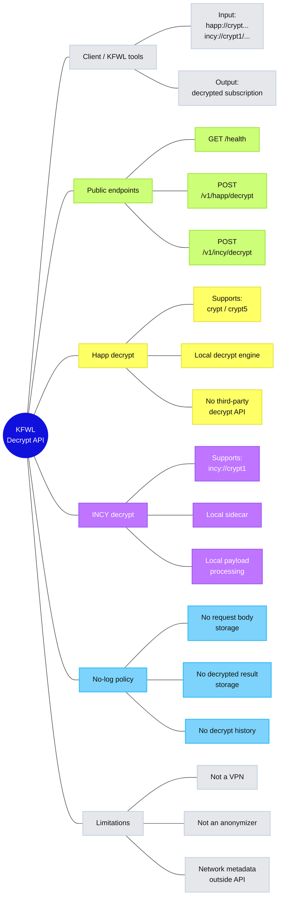

# KFWL Decrypt API

No-log API для локальной расшифровки VPN-ссылок форматов Happ и INCY.

Основной endpoint: `https://api.ioo.ir`

## TL;DR

- Расшифровывает `happ://crypt...`, `happ://crypt5/...` и `incy://crypt1/...`.
- Не хранит входящие ссылки.
- Не хранит результаты расшифровки.
- Не сохраняет request body.
- Не ведёт историю decrypt-запросов.
- Happ/INCY decrypt выполняется локально на сервере API.
- Это не VPN и не proxy-сервис, а только decrypt API.

---

## Architecture map



---

## Endpoints

### Health check

`GET /health`

Пример:

```bash
curl https://api.ioo.ir/health
```

Пример ответа:

```json
{
  "ok": true,
  "service": "incy-sidecar"
}
```

---

### Happ decrypt

`POST /v1/happ/decrypt`

Header:

`Content-Type: application/json`

Body:

```json
{
  "link": "happ://crypt5/..."
}
```

Пример:

```bash
curl -s -X POST https://api.ioo.ir/v1/happ/decrypt \
  -H 'Content-Type: application/json' \
  -d '{"link":"happ://crypt5/..."}'
```

---

### INCY decrypt

`POST /v1/incy/decrypt`

Header:

`Content-Type: application/json`

Body:

```json
{
  "link": "incy://crypt1/..."
}
```

Пример:

```bash
curl -s -X POST https://api.ioo.ir/v1/incy/decrypt \
  -H 'Content-Type: application/json' \
  -d '{"link":"incy://crypt1/..."}'
```

---

## No-log policy

KFWL Decrypt API сделан как no-log сервис.

Мы не сохраняем:

- исходные `happ://` / `incy://` ссылки;
- расшифрованные подписки;
- тела POST-запросов;
- содержимое payload;
- историю расшифровок;
- отдельную базу запросов;
- пользовательские токены, HWID или параметры подписок.

API обрабатывает запрос, возвращает результат и не записывает содержимое запроса или результата в постоянное хранилище.

---

## Что может существовать вне API

No-log на уровне приложения не означает абсолютную анонимность в интернете.

Мы не контролируем:

- сеть пользователя;
- DNS пользователя;
- интернет-провайдера пользователя;
- инфраструктурные метаданные хостинг-провайдера;
- технические сетевые события вне приложения.

KFWL Decrypt API отвечает только за то, что само приложение не хранит переданные ссылки, payload и результаты расшифровки.

---

## Как работает Happ decrypt

Для Happ-ссылок используется локальный decrypt engine.

Поддерживается локальная обработка через серверные компоненты API:

- локальный decrypt runner;
- локальная обработка нужных данных;
- локальная таблица ключей;
- без передачи ссылки стороннему decrypt API.

Запрос вида:

```
happ://crypt5/...
```

обрабатывается на стороне KFWL Decrypt API локально.

---

## Как работает INCY decrypt

`incy://crypt1/...` расшифровывается локально на сервере API.

Payload обрабатывается локально и не отправляется наружу.

---

## Быстрый тест

Health:

```bash
curl -s https://api.ioo.ir/health
```

Happ decrypt:

```bash
curl -s -X POST https://api.ioo.ir/v1/happ/decrypt \
  -H 'Content-Type: application/json' \
  -d '{"link":"happ://crypt5/..."}'
```

INCY decrypt:

```bash
curl -s -X POST https://api.ioo.ir/v1/incy/decrypt \
  -H 'Content-Type: application/json' \
  -d '{"link":"incy://crypt1/..."}'
```

Если endpoint работает, ответ будет JSON или ошибка decrypt engine. Если приходит HTML-страница, значит endpoint временно недоступен или неверно настроен домен.

---

## Privacy model

Цель проекта — минимизировать следы обработки.

Принципы:

1. Не хранить входящие ссылки.
2. Не хранить результат расшифровки.
3. Не сохранять request body.
4. Не вести историю decrypt-запросов.
5. Не использовать сторонний decrypt API для локально поддерживаемых форматов.
6. Держать API минимальным и предсказуемым.

---

## Limitations

KFWL Decrypt API не является инструментом анонимизации.

Сервис не скрывает:

- IP пользователя от сетевой инфраструктуры;
- факт соединения с доменом API;
- DNS-запросы пользователя;
- сетевые метаданные вне приложения.

No-log policy относится к содержимому decrypt-запросов и результатам расшифровки на стороне приложения.

---

## Status

Проект используется для KFWL-инструментов и приватной расшифровки VPN-ссылок.

Production endpoint: `https://api.ioo.ir`
